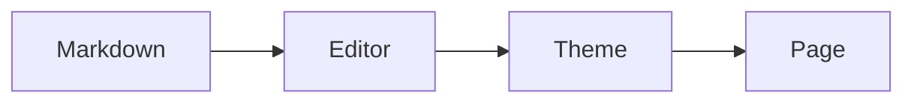

# Welcome to Kiwidown

A Markdown editor that wears **real Typora themes** — the ones the community already
wrote, used *unmodified*. Everything on this page is editable, and nothing is stored that
isn't in the `.md`. Pick a theme from the toolbar: the page redresses itself without
rewrapping a line. [^1]

[TOC]

## Editing

Syntax markers work the way Typora's do — the `**` around **bold** appears only while the
caret is inside it, and goes away when you move on. Click into this sentence and watch the
punctuation come and go.

Inline you get ==highlight==, X^2^, H~2~O, 🥝, $E = mc^2$, and links to
[CommonMark](https://commonmark.org) or [GFM](https://github.github.com/gfm/). Emoji
shortcodes like `:kiwi_fruit:` resolve as you type.

> Blockquotes, tables, task lists, footnotes, formulas and diagrams all round-trip.
> Save the file and you get back the Markdown that made this page.

---

## Blocks

### Lists

1. Ordered items, with anything nested underneath:
   + a bullet
   + and another
     + [x] a task that is done
     + [ ] one that is not

### Tables

| Shortcut     | What it does         |
| :----------- | :------------------- |
| `Ctrl+O`     | open a `.md` file    |
| `Ctrl+S`     | save it back         |
| `Ctrl+Alt+N` | start a new document |

### Code

Fenced code is tokenised with Prism, then relabelled with CodeMirror's class names —
which is what Typora themes colour against:

```html
<!DOCTYPE html>
<html>
  <body>
    <p id="out"></p>
    <script>
      var count = 42
      document.getElementById("out").innerHTML = count
    </script>
  </body>
</html>
```

### Math

KaTeX renders `$…$` inline and `$$…$$` as its own block, and is fetched the first time a
document actually contains a formula:

$$
\int_{-\infty}^{\infty} e^{-x^2}\,dx = \sqrt{\pi}
$$

### Diagrams

A fence tagged `mermaid` renders as a diagram, and stays editable as its own source:



## One deliberate omission


Raw inline HTML such as <u>this</u> is shown as text rather than rendered. Typora renders
it; we don't, because `?src=` will load a document from any URL and rendering its HTML
would run whatever it contains.

[^1]: Themes are vendored byte-for-byte under their own licences — see the project README.
